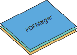

# PDF

PDF splitter / merger

# Teknologi
* [UI/UX Design Prototype: Adobe XD](https://xd.adobe.com/view/788bb0a2-f54e-459d-865b-cf6280c9ff47-2dd8/?fullscreen)
* [Next.js med Typescript](https://nextjs.org/)
* [pdf-lib](https://pdf-lib.js.org/)
* Single-page
* Alt kjører client-side: Ingen store filer lastes opp/ned til server

# Funksjoner
* Brukervennlig drag and drop
* Spleise 2 eller flere PDFer sammen
* Splitte enkelte sider eller flere sider av gangen fra PDF
* Stokke om på siderekkefølge i PDF
* Rotere og speilvende sider i PDF
* Konvertere ulike filer til PDF, som bilder, kodefiler og mer

# Oppdatere versjon på nettet
* Logg på SSH på pdf.orakel.ntnu.no
* Naviger til /etc/var/www/PDF
* Skriv `pm2 stop pdf`
* Skriv `sudo git pull`
* Skriv `sudo npm i`
* Skriv `sudo npm run build`
* Skriv `pm2 start pdf`
* Nettsiden er nå oppdatert!
